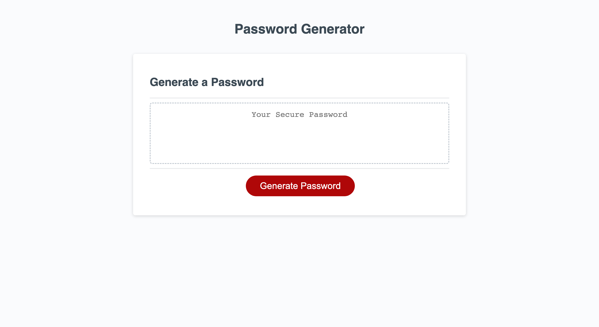

# PassWizard

Unlock the power of secure passwords with our cutting-edge web-based generator. Customize your password criteria and let our app do the rest. Built with the latest technologies like JavaScript, HTML, and CSS. Say goodbye to weak passwords and hello to password perfection.

## Project Link/Deployed Application 👇

* [@PassWizard](https://constantin-e-t.github.io/passwizard/)

## Table of Contents 🔗

* [Description](#description)
* [Screenshots](#screenshots)
* [Authors](#authors)
* [Skills](#skills)
* [License](#license)

## Description

* Allows users to customize the length and character types of their password

* Includes special characters, numeric characters, lowercase characters, and uppercase characters

* User-friendly and easy to use

* And the most Increase/Decrease in Profits

## Screenshots

## Authors

* [@Constantin-E-T](https://github.com/Constantin-E-T/)

## Skills

Javascript, HTML, CSS, Python, Django

## Tech Stack

**Client:** HTML, CSS, Javascript

## License

[MIT](https://choosealicense.com/licenses/mit/)